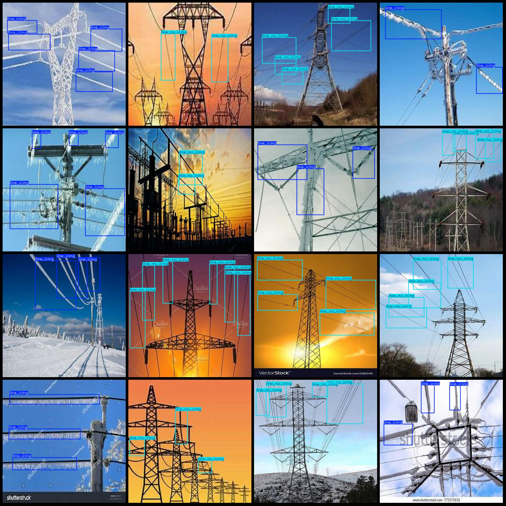

# Power Scenery Transmission Line Frost Detection Dataset VOC+YOLO format with 109 images in 2 categories

Dataset format: Pascal VOC format + YOLO format (txt file without split path, only containing jpg images and corresponding VOC format xml files and yolo format txt files)
number of images: 109  
annotation count: 109  
annotation count: 109  
annotationnumber of classes: 2  
["line_no_icing", "line_icing"]
boxes per class:   
Line Icing Frames = 175
line_no_icing box count = 213  
Total number of frames: 388
Image resolution: 640x640
Using the annotation tool: labelImg,
Annotation rules: draw a rectangle around the class.
Important notes: There are currently no notes.
Special Notice: This dataset does not guarantee the accuracy of the trained model or weight files.
Image preview:
Annotation example:
1. Example text:
   - "This is a sample text."
   - "Here's an example for you."
2. English translation:
   - "This is a sample text."
   - "Here's an example for you."
## Images

Here is a pay link on Stripe ( https://buy.stripe.com/3cs8yP7sY87d0vu9AB ). Please contact me lonlonago@foxmail.com after funding $89, and I will send you a complete data files , thank you!

